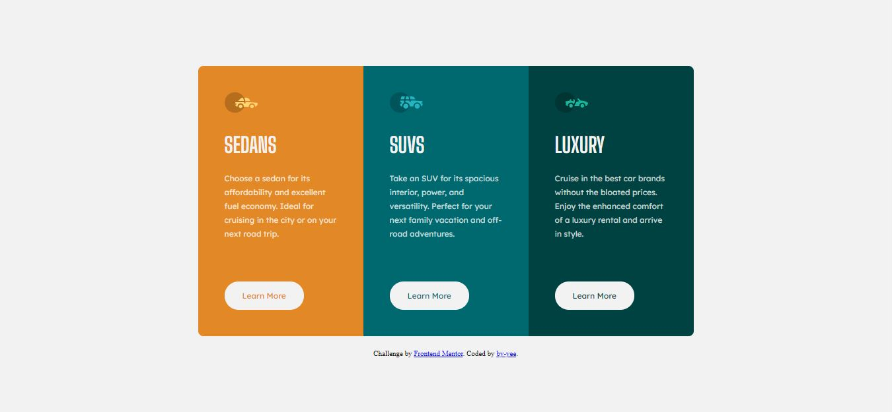

# Frontend Mentor - 3-column preview card component solution

This is a solution to the [3-column preview card component challenge on Frontend Mentor](https://www.frontendmentor.io/challenges/3column-preview-card-component-pH92eAR2-). 

## Table of contents

- [Overview](#overview)
  - [The challenge](#the-challenge)
  - [Screenshot](#screenshot)
  - [Links](#links)
- [My process](#my-process)
  - [Built with](#built-with)
  - [What I learned](#what-i-learned)
  - [Continued development](#continued-development)
- [Author](#author)

## Overview

### The challenge

The design should be able to:

- View the optimal layout depending on their device's screen size
- See hover states for interactive elements

### Screenshot

### Links

- Solution URL: [https://github.com/by-yee/3-card-component](https://github.com/by-yee/3-card-component)
- Live Site URL: [https://by-yee.github.io/3-card-component/](https://by-yee.github.io/3-card-component/)

## My process

### Built with

- Semantic HTML5 markup
- CSS custom properties
- Flexbox
- BEM

### What I learned

In this project, I learned to use BEM methodology and Sass preprocessor.

### Continued development

Challenge myself to use only pure CSS to create the design without using any framework.

## Author

- Frontend Mentor - [@by-yee](https://www.frontendmentor.io/profile/by-yee)
